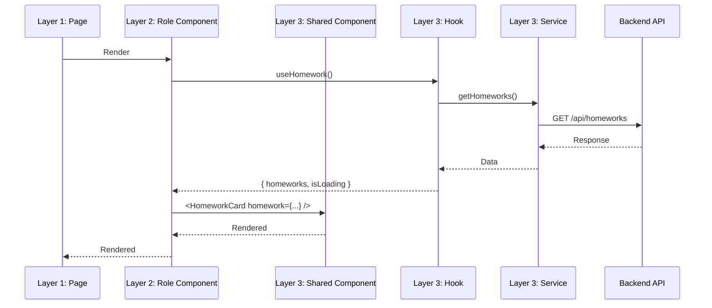

# 3 Katmanlı Mimari Dokümantasyonu

## 📋 Genel Bakış

Bu proje 3 katmanlı bir mimari yapısına sahiptir:

```
┌─────────────────────────────────────────────────────────┐
│  KATMAN 1: app/(dashboard)/[role]/                      │
│  → Routing & Sayfa Yapısı (Next.js Pages)               │
│  → Sadece layout ve data fetching                       │
└─────────────────────────────────────────────────────────┘
                        ↓ kullanır
┌─────────────────────────────────────────────────────────┐
│  KATMAN 2: components/[role]/                           │
│  → Rol-Spesifik UI Componentleri                        │
│  → Her rolün kendine özel görünümleri                   │
└─────────────────────────────────────────────────────────┘
                        ↓ kullanır
┌─────────────────────────────────────────────────────────┐
│  KATMAN 3: modules/[modul-adi]/                         │
│  → Paylaşımlı İş Mantığı & Componentler                 │
│  → Tüm roller tarafından kullanılabilir                 │
└─────────────────────────────────────────────────────────┘
```

## 🎯 Katman Sorumlulukları

### Katman 1: `app/(dashboard)/[role]/` - ROUTING

**Sorumluluklar:**
- ✅ Route tanımlama (URL yapısı)
- ✅ Metadata tanımlama (SEO)
- ✅ Layout yapısı
- ✅ Server-side data fetching (opsiyonel)

**Sorumluk DEĞİL:**
- ❌ İş mantığı
- ❌ UI component kodu
- ❌ API çağrıları (hook kullanır)

**Örnek:**
```tsx
// app/(dashboard)/ogretmen/odev/page.tsx
import { OgretmenOdevDashboard } from '@/components/ogretmen/odev/OgretmenOdevDashboard'

export const metadata = {
  title: 'Ödevler - Öğretmen Paneli',
  description: 'Ödev yönetimi ve değerlendirme'
}

export default function OgretmenOdevPage() {
  return <OgretmenOdevDashboard />
}
```

---

### Katman 2: `components/[role]/` - ROL-SPESİFİK UI

**Sorumluluklar:**
- ✅ Rol-spesifik layout ve görünüm
- ✅ Rol-spesifik aksiyonlar (butonlar, formlar)
- ✅ Paylaşımlı componentleri kullanma
- ✅ Rol bazlı veri filtreleme
- ✅ Hook kullanımı (Layer 3'ten)

**Sorumluk DEĞİL:**
- ❌ Ham API çağrıları (hook kullanır)
- ❌ İş mantığı (modül katmanında)
- ❌ Diğer rollerin UI'ı

**Örnek:**
```tsx
// components/ogretmen/odev/OgretmenOdevDashboard.tsx
'use client'

import { HomeworkCard } from '@/modules/odev/components/HomeworkCard'
import { useHomework } from '@/modules/odev/hooks/useHomework'
import { OdevNotlamaPanel } from './OdevNotlamaPanel'

export function OgretmenOdevDashboard() {
  const { homeworks, isLoading } = useHomework({ role: 'OGRETMEN' })

  return (
    <div className="space-y-6">
      <div className="grid grid-cols-3 gap-4">
        <StatCard title="Toplam Ödev" value={homeworks.length} />
        <StatCard title="Bekleyen Notlama" value={12} />
      </div>

      <div className="grid gap-4">
        {homeworks.map(homework => (
          <HomeworkCard 
            key={homework.id}
            homework={homework}
            actions={['edit', 'delete', 'grade']}
          />
        ))}
      </div>

      <OdevNotlamaPanel />
    </div>
  )
}
```

---

### Katman 3: `modules/[modul]/` - PAYLAŞIMLI İŞ MANTIĞI

**Sorumluluklar:**
- ✅ Tüm roller için paylaşımlı componentler
- ✅ API hooks ve servisler
- ✅ TypeScript tipleri
- ✅ Validation schemaları
- ✅ Yardımcı fonksiyonlar
- ✅ State management (Zustand stores)

**Sorumluk DEĞİL:**
- ❌ Rol-spesifik UI
- ❌ Routing

**Yapı:**
```
modules/[modul]/
├── components/     # Paylaşımlı UI componentleri
├── hooks/          # React Query hooks
├── types/          # TypeScript tipleri
├── services/       # API servisleri
├── utils/          # Yardımcı fonksiyonlar
├── validations/    # Zod schemaları
└── store/          # Zustand stores (opsiyonel)
```

**Örnek Hook:**
```tsx
// modules/odev/hooks/useHomework.ts
import { useQuery } from '@tanstack/react-query'
import { homeworkService } from '../services/homework.service'
import type { UserRole } from '@/types'

interface UseHomeworkOptions {
  role: UserRole
  filters?: HomeworkFilters
}

export function useHomework({ role, filters }: UseHomeworkOptions) {
  return useQuery({
    queryKey: ['homeworks', role, filters],
    queryFn: () => homeworkService.getHomeworks({ role, filters })
  })
}
```

**Örnek Component:**
```tsx
// modules/odev/components/HomeworkCard.tsx
import { Card } from '@/components/ui/card'
import type { Homework } from '../types'

interface HomeworkCardProps {
  homework: Homework
  actions?: ('edit' | 'delete' | 'grade' | 'submit')[]
}

export function HomeworkCard({ homework, actions }: HomeworkCardProps) {
  return (
    <Card>
      <h3>{homework.title}</h3>
      <p>{homework.description}</p>
      
      {actions?.includes('grade') && <GradeButton />}
      {actions?.includes('submit') && <SubmitButton />}
    </Card>
  )
}
```

---

## 📁 Tam Dizin Yapısı

### Layer 1: Routing

```
app/(dashboard)/
├── admin/
│   ├── odev/
│   │   ├── page.tsx
│   │   ├── [id]/
│   │   │   ├── page.tsx
│   │   │   └── edit/
│   │   │       └── page.tsx
│   │   └── yeni/
│   │       └── page.tsx
│   │
│   └── kantin/
│       ├── page.tsx
│       ├── urunler/
│       │   ├── page.tsx
│       │   ├── [id]/page.tsx
│       │   └── yeni/page.tsx
│       ├── siparisler/page.tsx
│       └── stok/page.tsx
│
├── ogretmen/
│   ├── odev/
│   │   ├── page.tsx
│   │   ├── [id]/
│   │   │   ├── page.tsx
│   │   │   ├── notla/page.tsx
│   │   │   └── teslimler/page.tsx
│   │   └── yeni/page.tsx
│   │
│   └── devamsizlik/
│       ├── page.tsx
│       └── yoklama-al/page.tsx
│
├── ogrenci/
│   ├── odev/
│   │   ├── page.tsx
│   │   └── [id]/
│   │       ├── page.tsx
│   │       └── teslim/page.tsx
│   │
│   └── kantin/
│       ├── page.tsx
│       ├── sepet/page.tsx
│       └── siparislerim/page.tsx
│
├── veli/
│   ├── cocuklar/page.tsx
│   ├── konum/[childId]/page.tsx
│   └── odev/[childId]/page.tsx
│
├── kantinci/
│   ├── urunler/
│   │   ├── page.tsx
│   │   ├── [id]/page.tsx
│   │   └── yeni/page.tsx
│   │
│   └── siparisler/
│       ├── page.tsx
│       └── [id]/page.tsx
│
└── servici/
    ├── rotalar/
    │   ├── page.tsx
    │   └── [id]/page.tsx
    │
    └── konum/page.tsx
```

### Layer 2: Role-Specific Components

```
components/
├── admin/
│   ├── odev/
│   │   ├── AdminOdevDashboard.tsx
│   │   ├── AdminOdevTable.tsx
│   │   ├── AdminOdevStats.tsx
│   │   ├── AdminOdevFilters.tsx
│   │   └── AdminOdevActions.tsx
│   │
│   ├── kantin/
│   │   ├── AdminKantinDashboard.tsx
│   │   ├── AdminKantinReports.tsx
│   │   └── AdminKantinSettings.tsx
│   │
│   └── layout/
│       ├── AdminSidebar.tsx
│       ├── AdminHeader.tsx
│       └── AdminStats.tsx
│
├── ogretmen/
│   ├── odev/
│   │   ├── OgretmenOdevDashboard.tsx
│   │   ├── OdevOlusturForm.tsx
│   │   ├── OdevNotlamaPanel.tsx
│   │   ├── OdevTeslimlerTable.tsx
│   │   └── OdevDurumuCard.tsx
│   │
│   ├── devamsizlik/
│   │   ├── YoklamaAlPanel.tsx
│   │   ├── DevamsizlikListesi.tsx
│   │   └── DevamsizlikIstatistik.tsx
│   │
│   └── layout/
│       ├── OgretmenSidebar.tsx
│       └── OgretmenHeader.tsx
│
├── ogrenci/
│   ├── odev/
│   │   ├── OgrenciOdevDashboard.tsx
│   │   ├── OdevListesiCard.tsx
│   │   ├── OdevTeslimForm.tsx
│   │   └── OdevDurumBadge.tsx
│   │
│   ├── kantin/
│   │   ├── OgrenciKantinMenu.tsx
│   │   ├── KantinSepet.tsx
│   │   ├── BakiyeWidget.tsx
│   │   └── SiparisGecmisi.tsx
│   │
│   └── layout/
│       ├── OgrenciSidebar.tsx
│       └── OgrenciHeader.tsx
│
├── veli/
│   ├── konum/
│   │   ├── CocukKonumTracker.tsx
│   │   ├── KonumGecmisi.tsx
│   │   └── GuvenliAlanlar.tsx
│   │
│   ├── odev/
│   │   ├── CocukOdevListesi.tsx
│   │   └── OdevDetayCard.tsx
│   │
│   └── layout/
│       ├── VeliSidebar.tsx
│       ├── CocukSecici.tsx
│       └── VeliHeader.tsx
│
├── kantinci/
│   ├── urunler/
│   │   ├── UrunYonetimPanel.tsx
│   │   ├── UrunForm.tsx
│   │   ├── StokTakip.tsx
│   │   └── UrunKategoriManager.tsx
│   │
│   ├── siparisler/
│   │   ├── SiparisYonetimPanel.tsx
│   │   ├── AktifSiparisler.tsx
│   │   └── SiparisDetay.tsx
│   │
│   └── layout/
│       └── KantinciSidebar.tsx
│
└── servici/
    ├── rotalar/
    │   ├── RotaYonetimPanel.tsx
    │   ├── RotaHaritasi.tsx
    │   └── OgrenciAtama.tsx
    │
    ├── konum/
    │   ├── AracKonumTracker.tsx
    │   └── RotaTakip.tsx
    │
    └── layout/
        └── ServiciSidebar.tsx
```

### Layer 3: Shared Modules

```
modules/
├── odev/
│   ├── components/
│   │   ├── HomeworkCard.tsx
│   │   ├── HomeworkForm.tsx
│   │   ├── HomeworkList.tsx
│   │   ├── HomeworkDetail.tsx
│   │   ├── HomeworkSubmit.tsx
│   │   ├── HomeworkGrading.tsx
│   │   └── HomeworkStatus.tsx
│   │
│   ├── hooks/
│   │   ├── useHomework.ts
│   │   ├── useHomeworkDetail.ts
│   │   ├── useCreateHomework.ts
│   │   ├── useUpdateHomework.ts
│   │   ├── useDeleteHomework.ts
│   │   ├── useHomeworkSubmit.ts
│   │   └── useHomeworkGrade.ts
│   │
│   ├── types/
│   │   ├── homework.types.ts
│   │   ├── submission.types.ts
│   │   └── index.ts
│   │
│   ├── services/
│   │   ├── homework.service.ts
│   │   └── submission.service.ts
│   │
│   ├── utils/
│   │   ├── homework.helpers.ts
│   │   ├── date.helpers.ts
│   │   └── validation.helpers.ts
│   │
│   └── validations/
│       ├── homework.schema.ts
│       └── submission.schema.ts
│
├── kantin/
│   ├── components/
│   │   ├── ProductCard.tsx
│   │   ├── ProductForm.tsx
│   │   ├── ProductList.tsx
│   │   ├── OrderCart.tsx
│   │   ├── OrderHistory.tsx
│   │   ├── BalanceWidget.tsx
│   │   └── CategoryFilter.tsx
│   │
│   ├── hooks/
│   │   ├── useProducts.ts
│   │   ├── useCart.ts
│   │   ├── useOrders.ts
│   │   ├── useBalance.ts
│   │   └── useCategories.ts
│   │
│   ├── types/
│   │   ├── product.types.ts
│   │   ├── order.types.ts
│   │   ├── cart.types.ts
│   │   └── balance.types.ts
│   │
│   ├── services/
│   │   ├── product.service.ts
│   │   ├── order.service.ts
│   │   └── balance.service.ts
│   │
│   └── store/
│       └── cart.store.ts
│
├── konum/
│   ├── components/
│   │   ├── LocationMap.tsx
│   │   ├── LocationTracker.tsx
│   │   ├── LocationHistory.tsx
│   │   ├── SafeZoneManager.tsx
│   │   └── RouteMap.tsx
│   │
│   ├── hooks/
│   │   ├── useLocation.ts
│   │   ├── useLocationTracking.ts
│   │   ├── useLocationHistory.ts
│   │   └── useSafeZones.ts
│   │
│   ├── types/
│   │   ├── location.types.ts
│   │   ├── tracking.types.ts
│   │   └── route.types.ts
│   │
│   └── services/
│       ├── location.service.ts
│       ├── tracking.service.ts
│       └── geofence.service.ts
│
├── servis/
│   ├── components/
│   │   ├── RouteCard.tsx
│   │   ├── VehicleCard.tsx
│   │   ├── RouteMap.tsx
│   │   ├── StudentAssignment.tsx
│   │   └── RouteStatus.tsx
│   │
│   ├── hooks/
│   │   ├── useRoutes.ts
│   │   ├── useVehicles.ts
│   │   └── useRouteTracking.ts
│   │
│   ├── types/
│   │   ├── route.types.ts
│   │   ├── vehicle.types.ts
│   │   └── assignment.types.ts
│   │
│   └── services/
│       ├── route.service.ts
│       └── vehicle.service.ts
│
├── devamsizlik/
│   ├── components/
│   │   ├── AttendanceTable.tsx
│   │   ├── AttendanceTaker.tsx
│   │   ├── AttendanceCalendar.tsx
│   │   ├── AttendanceStats.tsx
│   │   └── AttendanceReport.tsx
│   │
│   ├── hooks/
│   │   ├── useAttendance.ts
│   │   ├── useTakeAttendance.ts
│   │   └── useAttendanceStats.ts
│   │
│   ├── types/
│   │   └── attendance.types.ts
│   │
│   └── services/
│       └── attendance.service.ts
│
├── notlar/
│   ├── components/
│   │   ├── GradeTable.tsx
│   │   ├── GradeForm.tsx
│   │   ├── GradeCard.tsx
│   │   ├── ReportCard.tsx
│   │   └── GradeChart.tsx
│   │
│   ├── hooks/
│   │   ├── useGrades.ts
│   │   ├── useCreateGrade.ts
│   │   └── useReportCard.ts
│   │
│   ├── types/
│   │   └── grade.types.ts
│   │
│   └── services/
│       └── grade.service.ts
│
├── mesaj/
│   ├── components/
│   │   ├── MessageList.tsx
│   │   ├── MessageThread.tsx
│   │   ├── MessageComposer.tsx
│   │   ├── MessageBubble.tsx
│   │   └── MessageNotification.tsx
│   │
│   ├── hooks/
│   │   ├── useMessages.ts
│   │   ├── useSendMessage.ts
│   │   └── useMessageThread.ts
│   │
│   ├── types/
│   │   └── message.types.ts
│   │
│   └── services/
│       └── message.service.ts
│
├── odeme/
│   ├── components/
│   │   ├── PaymentForm.tsx
│   │   ├── PaymentHistory.tsx
│   │   ├── DebtCard.tsx
│   │   ├── InvoiceCard.tsx
│   │   └── PaymentMethodSelector.tsx
│   │
│   ├── hooks/
│   │   ├── usePayments.ts
│   │   ├── useDebts.ts
│   │   └── useCreatePayment.ts
│   │
│   ├── types/
│   │   ├── payment.types.ts
│   │   └── debt.types.ts
│   │
│   └── services/
│       ├── payment.service.ts
│       └── debt.service.ts
│
├── etkinlik/
│   ├── components/
│   ├── hooks/
│   ├── types/
│   └── services/
│
├── duyuru/
│   ├── components/
│   ├── hooks/
│   ├── types/
│   └── services/
│
├── ders-programi/
│   ├── components/
│   ├── hooks/
│   ├── types/
│   └── services/
│
└── donem/
    ├── components/
    ├── hooks/
    ├── types/
    └── services/
```

---

## 🔄 Veri Akışı



---

## ✅ En İyi Pratikler

### 1. Katman Bağımsızlığı
- Her katman sadece bir alt katmanı kullanmalı
- Katmanlar arası doğrudan bağımlılık olmamalı
- Circular dependency'den kaçının

### 2. Component Paylaşımı
- Ortak UI componentleri Layer 3'te
- Rol-spesifik UI Layer 2'de
- Routing Layer 1'de

### 3. Type Safety
- Tüm modüller için TypeScript tipleri tanımlayın
- Zod ile runtime validation yapın
- API response'ları için tip güvenliği sağlayın

### 4. Hook Kullanımı
- API çağrıları için React Query hooks kullanın
- Custom hooks Layer 3'te tanımlayın
- Hook'ları rol-spesifik componentlerde kullanın

### 5. State Management
- Global state için Zustand kullanın
- Store'ları Layer 3'te tanımlayın
- Modül bazlı store organizasyonu yapın

---

## 🚀 Geliştirme Workflow'u

### Yeni Bir Modül Eklerken:

1. **Layer 3: Modül Oluştur**
   ```bash
   mkdir -p modules/yeni-modul/{components,hooks,types,services}
   ```

2. **Types Tanımla**
   ```typescript
   // modules/yeni-modul/types/index.ts
   export interface YeniModul {
     id: string
     name: string
   }
   ```

3. **Service Oluştur**
   ```typescript
   // modules/yeni-modul/services/yeni-modul.service.ts
   export const yeniModulService = {
     getAll: () => api.get('/api/yeni-modul'),
     getById: (id: string) => api.get(`/api/yeni-modul/${id}`)
   }
   ```

4. **Hook Oluştur**
   ```typescript
   // modules/yeni-modul/hooks/useYeniModul.ts
   export function useYeniModul() {
     return useQuery({
       queryKey: ['yeni-modul'],
       queryFn: yeniModulService.getAll
     })
   }
   ```

5. **Shared Component Oluştur**
   ```typescript
   // modules/yeni-modul/components/YeniModulCard.tsx
   export function YeniModulCard({ data }: Props) {
     return <Card>...</Card>
   }
   ```

6. **Layer 2: Rol-Spesifik Component**
   ```typescript
   // components/ogretmen/yeni-modul/OgretmenYeniModulDashboard.tsx
   export function OgretmenYeniModulDashboard() {
     const { data } = useYeniModul()
     return <YeniModulCard data={data} />
   }
   ```

7. **Layer 1: Route Ekle**
   ```typescript
   // app/(dashboard)/ogretmen/yeni-modul/page.tsx
   export default function Page() {
     return <OgretmenYeniModulDashboard />
   }
   ```

---

## 📝 Kod Standartları

### Import Sırası
```typescript
// 1. React & Next.js
import { useState } from 'react'
import Link from 'next/link'

// 2. External libraries
import { useQuery } from '@tanstack/react-query'

// 3. Internal - Layer 3 (modules)
import { useHomework } from '@/modules/odev/hooks/useHomework'
import { HomeworkCard } from '@/modules/odev/components/HomeworkCard'

// 4. Internal - Layer 2 (components)
import { OdevNotlamaPanel } from './OdevNotlamaPanel'

// 5. Types
import type { Homework } from '@/modules/odev/types'

// 6. Styles
import styles from './styles.module.css'
```

### Naming Conventions
- **Pages:** `page.tsx`, `layout.tsx`, `loading.tsx`, `error.tsx`
- **Components:** PascalCase - `HomeworkCard.tsx`
- **Hooks:** camelCase with 'use' prefix - `useHomework.ts`
- **Types:** PascalCase - `homework.types.ts`
- **Services:** camelCase with 'Service' suffix - `homework.service.ts`
- **Utils:** camelCase - `date.helpers.ts`

---

## 🎓 Roller ve Modüller

### Roller (6 adet)
1. **admin** - Sistem yöneticisi
2. **ogretmen** - Öğretmen
3. **ogrenci** - Öğrenci
4. **veli** - Veli
5. **kantinci** - Kantin görevlisi
6. **servici** - Servis şoförü

### Modüller (12 adet)
1. **odev** - Ödev yönetimi
2. **kantin** - Kantin ve sipariş sistemi
3. **konum** - Konum takibi
4. **servis** - Servis yönetimi
5. **devamsizlik** - Yoklama ve devamsızlık
6. **notlar** - Not yönetimi
7. **mesaj** - Mesajlaşma sistemi
8. **odeme** - Ödeme yönetimi
9. **etkinlik** - Etkinlik yönetimi
10. **duyuru** - Duyuru sistemi
11. **ders-programi** - Ders programı
12. **donem** - Dönem yönetimi
