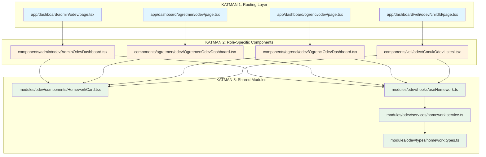
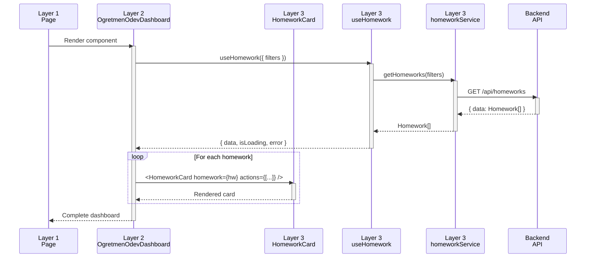
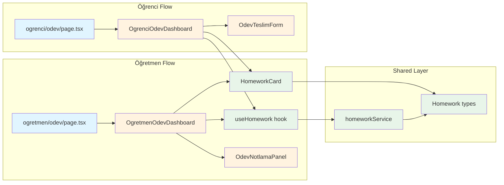

# 3 Katmanlı Mimari - Görsel Referans

## 📊 Katman Diyagramı



## 🔄 Veri Akış Diyagramı



## 📁 Dizin Yapısı Ağacı

```
src/
│
├── app/(dashboard)/              # KATMAN 1: Routing
│   ├── admin/
│   │   ├── odev/
│   │   │   ├── page.tsx         ← Minimal, sadece component çağırır
│   │   │   ├── [id]/page.tsx
│   │   │   └── yeni/page.tsx
│   │   └── kantin/
│   │       └── ...
│   │
│   ├── ogretmen/
│   │   ├── odev/
│   │   │   ├── page.tsx         ← Minimal, sadece component çağırır
│   │   │   ├── [id]/
│   │   │   │   ├── page.tsx
│   │   │   │   ├── notla/page.tsx
│   │   │   │   └── teslimler/page.tsx
│   │   │   └── yeni/page.tsx
│   │   └── devamsizlik/
│   │       └── ...
│   │
│   ├── ogrenci/
│   │   ├── odev/
│   │   └── kantin/
│   │
│   ├── veli/
│   │   ├── konum/
│   │   └── odev/
│   │
│   ├── kantinci/
│   │   ├── urunler/
│   │   └── siparisler/
│   │
│   └── servici/
│       ├── rotalar/
│       └── konum/
│
├── components/                   # KATMAN 2: Role-Specific UI
│   ├── admin/
│   │   ├── odev/
│   │   │   ├── AdminOdevDashboard.tsx
│   │   │   ├── AdminOdevTable.tsx
│   │   │   └── AdminOdevStats.tsx
│   │   ├── kantin/
│   │   └── layout/
│   │
│   ├── ogretmen/
│   │   ├── odev/
│   │   │   ├── OgretmenOdevDashboard.tsx  ← Rol-spesifik UI
│   │   │   ├── OdevOlusturForm.tsx
│   │   │   └── OdevNotlamaPanel.tsx
│   │   ├── devamsizlik/
│   │   └── layout/
│   │
│   ├── ogrenci/
│   │   ├── odev/
│   │   ├── kantin/
│   │   └── layout/
│   │
│   ├── veli/
│   │   ├── konum/
│   │   ├── odev/
│   │   └── layout/
│   │
│   ├── kantinci/
│   │   ├── urunler/
│   │   ├── siparisler/
│   │   └── layout/
│   │
│   └── servici/
│       ├── rotalar/
│       ├── konum/
│       └── layout/
│
└── modules/                      # KATMAN 3: Shared Business Logic
    ├── odev/
    │   ├── components/
    │   │   ├── HomeworkCard.tsx          ← Paylaşımlı, tüm roller kullanır
    │   │   ├── HomeworkForm.tsx
    │   │   ├── HomeworkList.tsx
    │   │   └── HomeworkStatus.tsx
    │   ├── hooks/
    │   │   ├── useHomework.ts            ← React Query hooks
    │   │   ├── useCreateHomework.ts
    │   │   └── useHomeworkGrade.ts
    │   ├── types/
    │   │   ├── homework.types.ts         ← TypeScript types
    │   │   └── submission.types.ts
    │   ├── services/
    │   │   └── homework.service.ts       ← API calls
    │   ├── utils/
    │   │   └── homework.helpers.ts
    │   └── validations/
    │       └── homework.schema.ts        ← Zod schemas
    │
    ├── kantin/
    │   ├── components/
    │   ├── hooks/
    │   ├── types/
    │   ├── services/
    │   └── store/                        ← Zustand store (sepet)
    │
    ├── konum/
    ├── servis/
    ├── devamsizlik/
    ├── notlar/
    ├── mesaj/
    ├── odeme/
    ├── etkinlik/
    ├── duyuru/
    ├── ders-programi/
    └── donem/
```

## 🎯 Sorumluluk Matrisi

| Katman | Sorumluluklar | Sorumluk DEĞİL |
|--------|---------------|----------------|
| **Layer 1: Routing** | • Route tanımlama<br>• Metadata (SEO)<br>• Layout yapısı | • İş mantığı<br>• UI component kodu<br>• API çağrıları |
| **Layer 2: Role-Specific** | • Rol-spesifik UI<br>• Rol-spesifik aksiyonlar<br>• Hook kullanımı<br>• Veri filtreleme | • Ham API çağrıları<br>• İş mantığı<br>• Diğer rollerin UI'ı |
| **Layer 3: Shared Modules** | • Paylaşımlı componentler<br>• API hooks<br>• TypeScript types<br>• Validations<br>• Utils | • Rol-spesifik UI<br>• Routing |

## 🔗 Component İlişkileri



## 📋 Örnek Kod Akışı

### 1. Page (Layer 1) - Minimal
```tsx
// app/(dashboard)/ogretmen/odev/page.tsx
import { OgretmenOdevDashboard } from '@/components/ogretmen/odev/OgretmenOdevDashboard'

export default function Page() {
  return <OgretmenOdevDashboard />  // Sadece component çağırır
}
```

### 2. Role Component (Layer 2) - Rol-Spesifik UI
```tsx
// components/ogretmen/odev/OgretmenOdevDashboard.tsx
'use client'

import { useHomework } from '@/modules/odev/hooks/useHomework'
import { HomeworkCard } from '@/modules/odev/components/HomeworkCard'

export function OgretmenOdevDashboard() {
  const { data: homeworks } = useHomework()  // Shared hook kullanır
  
  return (
    <div>
      {/* Öğretmene özel header ve stats */}
      <TeacherStats />
      
      {/* Paylaşımlı component, öğretmen aksiyonları ile */}
      {homeworks.map(hw => (
        <HomeworkCard 
          homework={hw} 
          actions={['edit', 'delete', 'grade']}  // Öğretmen aksiyonları
        />
      ))}
    </div>
  )
}
```

### 3. Shared Component (Layer 3) - Paylaşımlı
```tsx
// modules/odev/components/HomeworkCard.tsx
export function HomeworkCard({ homework, actions }) {
  return (
    <Card>
      <h3>{homework.title}</h3>
      {/* Rol bazlı aksiyonlar */}
      {actions.includes('grade') && <GradeButton />}
      {actions.includes('submit') && <SubmitButton />}
    </Card>
  )
}
```

### 4. Hook (Layer 3) - API Integration
```tsx
// modules/odev/hooks/useHomework.ts
import { useQuery } from '@tanstack/react-query'
import { homeworkService } from '../services/homework.service'

export function useHomework(filters) {
  return useQuery({
    queryKey: ['homeworks', filters],
    queryFn: () => homeworkService.getHomeworks(filters)
  })
}
```

### 5. Service (Layer 3) - API Calls
```tsx
// modules/odev/services/homework.service.ts
export const homeworkService = {
  getHomeworks: (filters) => api.get('/api/homeworks', { params: filters }),
  createHomework: (data) => api.post('/api/homeworks', data)
}
```

## 🎨 Renk Kodları

- 🔵 **Mavi (Layer 1)**: Routing katmanı - Minimal kod
- 🟠 **Turuncu (Layer 2)**: Rol-spesifik componentler - UI odaklı
- 🟢 **Yeşil (Layer 3)**: Paylaşımlı modüller - İş mantığı

## ✅ Kontrol Listesi

Yeni bir özellik eklerken:

- [ ] Layer 3'te type tanımlandı mı?
- [ ] Layer 3'te service oluşturuldu mu?
- [ ] Layer 3'te hook yazıldı mı?
- [ ] Layer 3'te paylaşımlı component var mı?
- [ ] Layer 2'de rol-spesifik component oluşturuldu mu?
- [ ] Layer 2 component Layer 3 modüllerini kullanıyor mu?
- [ ] Layer 1'de route tanımlandı mı?
- [ ] Layer 1 sadece component çağırıyor mu?
- [ ] Circular dependency yok mu?
- [ ] TypeScript tipleri doğru mu?
