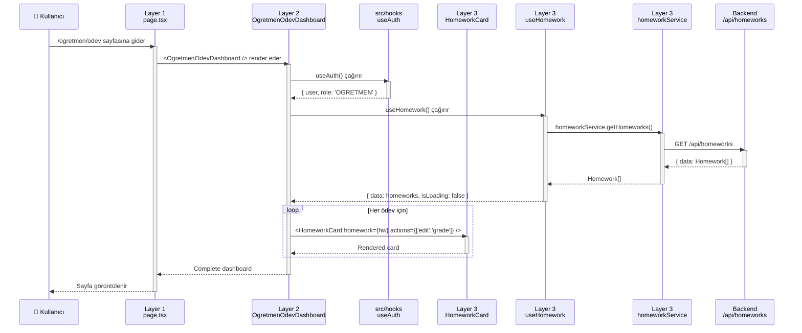

# 🔄 3-Katmanlı Mimari - Veri Akışı ve İlişkiler

## 📊 GENEL VERİ AKIŞI

```mermaid
graph TB
    subgraph "LAYER 1: Routing (app/dashboard/role)"
        Page[page.tsx<br/>Minimal kod]
    end
    
    subgraph "LAYER 2: Role-Specific Components (components/role)"
        RoleComp[OgretmenOdevDashboard.tsx<br/>Rol-spesifik UI]
        RoleLayout[Layout Components<br/>Sidebar, Header]
    end
    
    subgraph "LAYER 3: Shared Modules (modules/modul)"
        SharedComp[HomeworkCard.tsx<br/>Paylaşımlı Component]
        ModuleHook[useHomework.ts<br/>API Hook]
        Service[homework.service.ts<br/>API Calls]
        Types[homework.types.ts<br/>TypeScript Types]
    end
    
    subgraph "GENERAL UTILITIES (src/hooks)"
        GeneralHook[useAuth.ts<br/>useDebounce.ts<br/>Genel Hooks]
    end
    
    subgraph "BACKEND"
        API[/api/homeworks<br/>Backend API]
    end

    Page -->|renders| RoleComp
    RoleComp -->|uses| SharedComp
    RoleComp -->|uses| ModuleHook
    RoleComp -->|uses| GeneralHook
    ModuleHook -->|calls| Service
    Service -->|HTTP| API
    Service -->|uses| Types
    SharedComp -->|uses| Types
    RoleComp -->|uses| Types
```

---

## 🎯 DETAYLI VERİ AKIŞI - ÖDEV ÖRNEĞİ

### Senaryo: Öğretmen ödev listesini görüntülüyor



---

## 📁 DOSYA YAPISI VE İLİŞKİLER

```
┌─────────────────────────────────────────────────────────────┐
│ LAYER 1: app/(dashboard)/ogretmen/odev/page.tsx            │
│                                                             │
│ import { OgretmenOdevDashboard }                           │
│   from '@/components/ogretmen/odev/OgretmenOdevDashboard'  │
│                                                             │
│ export default function Page() {                           │
│   return <OgretmenOdevDashboard />                         │
│ }                                                           │
└─────────────────────────────────────────────────────────────┘
                            ↓ renders
┌─────────────────────────────────────────────────────────────┐
│ LAYER 2: components/ogretmen/odev/                         │
│          OgretmenOdevDashboard.tsx                         │
│                                                             │
│ // Genel hooks                                             │
│ import { useAuth } from '@/hooks/use-auth'                 │
│ import { useDebounce } from '@/hooks/use-debounce'         │
│                                                             │
│ // Modül hooks (API)                                       │
│ import { useHomework }                                     │
│   from '@/modules/odev/hooks/useHomework'                  │
│                                                             │
│ // Paylaşımlı components                                   │
│ import { HomeworkCard }                                    │
│   from '@/modules/odev/components/HomeworkCard'            │
│                                                             │
│ // Rol-spesifik components                                 │
│ import { OdevNotlamaPanel } from './OdevNotlamaPanel'      │
│                                                             │
│ export function OgretmenOdevDashboard() {                  │
│   const { user, role } = useAuth()        // Genel hook    │
│   const { data } = useHomework()          // Modül hook    │
│                                                             │
│   return (                                                 │
│     <div>                                                  │
│       {data?.map(hw => (                                   │
│         <HomeworkCard                     // Paylaşımlı   │
│           homework={hw}                                    │
│           actions={['edit', 'grade']}     // Rol-spesifik │
│         />                                                 │
│       ))}                                                  │
│       <OdevNotlamaPanel />                // Rol-spesifik │
│     </div>                                                 │
│   )                                                        │
│ }                                                           │
└─────────────────────────────────────────────────────────────┘
                ↓ uses                    ↓ uses
    ┌───────────────────┐      ┌──────────────────────┐
    │ src/hooks/        │      │ modules/odev/        │
    │ use-auth.ts       │      │                      │
    │                   │      │ hooks/               │
    │ useAuth() {       │      │   useHomework.ts     │
    │   const session   │      │                      │
    │   return {        │      │ components/          │
    │     user,         │      │   HomeworkCard.tsx   │
    │     role          │      │                      │
    │   }               │      │ services/            │
    │ }                 │      │   homework.service   │
    │                   │      │                      │
    │ ❌ API yok        │      │ types/               │
    │ ✅ Genel utility  │      │   homework.types.ts  │
    └───────────────────┘      └──────────────────────┘
                                         ↓
                               ┌──────────────────────┐
                               │ Backend API          │
                               │ /api/homeworks       │
                               └──────────────────────┘
```

---

## 🔗 HOOK İLİŞKİLERİ

### 1. Genel Hook (src/hooks/use-auth.ts)

```tsx
// ❌ API çağrısı YOK
// ✅ Session yönetimi
// ✅ Her yerde kullanılır

export function useAuth() {
  const session = useSession() // Next-Auth
  
  return {
    user: session?.user,
    role: session?.user?.role,
    isAuthenticated: !!session,
    isAdmin: session?.user?.role === 'ADMIN',
    isTeacher: session?.user?.role === 'OGRETMEN'
  }
}
```

**Kullanım:**
```tsx
// Her component'te kullanılabilir
const { user, role, isTeacher } = useAuth()
```

---

### 2. Modül Hook (modules/odev/hooks/useHomework.ts)

```tsx
// ✅ API çağrısı VAR
// ✅ React Query kullanır
// ✅ Service katmanını çağırır

import { useQuery } from '@tanstack/react-query'
import { homeworkService } from '../services/homework.service'
import type { Homework } from '../types'

export function useHomework() {
  return useQuery({
    queryKey: ['homeworks'],
    queryFn: () => homeworkService.getHomeworks(),
    staleTime: 5 * 60 * 1000, // 5 dakika
  })
}
```

**İlişkisi:**
```
useHomework (hook)
    ↓ calls
homeworkService (service)
    ↓ HTTP request
/api/homeworks (backend)
```

---

### 3. Service Katmanı (modules/odev/services/homework.service.ts)

```tsx
// ✅ Ham API çağrıları
// ✅ HTTP istekleri
// ✅ Error handling

import { api } from '@/lib/api/client'
import type { Homework } from '../types'

export const homeworkService = {
  async getHomeworks(): Promise<Homework[]> {
    const response = await api.get('/api/homeworks')
    return response.data
  },

  async getHomeworkById(id: string): Promise<Homework> {
    const response = await api.get(`/api/homeworks/${id}`)
    return response.data
  },

  async createHomework(data: CreateHomeworkInput): Promise<Homework> {
    const response = await api.post('/api/homeworks', data)
    return response.data
  }
}
```

---

## 🎨 COMPONENT İLİŞKİLERİ

### Paylaşımlı Component (modules/odev/components/HomeworkCard.tsx)

```tsx
// ✅ Tüm roller kullanabilir
// ✅ Rol bazlı aksiyonlar alır
// ❌ Rol-spesifik mantık YOK

import type { Homework } from '../types'

interface HomeworkCardProps {
  homework: Homework
  actions?: ('view' | 'edit' | 'delete' | 'grade' | 'submit')[]
  onAction?: (action: string, homework: Homework) => void
}

export function HomeworkCard({ homework, actions, onAction }: HomeworkCardProps) {
  return (
    <Card>
      <h3>{homework.title}</h3>
      <p>{homework.description}</p>
      
      {/* Rol bazlı aksiyonlar */}
      {actions?.includes('edit') && <EditButton />}
      {actions?.includes('grade') && <GradeButton />}
      {actions?.includes('submit') && <SubmitButton />}
    </Card>
  )
}
```

**Kullanım - Farklı Roller:**

```tsx
// Öğretmen
<HomeworkCard 
  homework={hw} 
  actions={['view', 'edit', 'delete', 'grade']} 
/>

// Öğrenci
<HomeworkCard 
  homework={hw} 
  actions={['view', 'submit']} 
/>

// Veli
<HomeworkCard 
  homework={hw} 
  actions={['view']} 
/>
```

---

## 🔄 TAM VERİ AKIŞI ÖRNEĞİ

### Senaryo: Öğretmen yeni ödev oluşturuyor

```
1. USER ACTION
   ↓
   Öğretmen "Yeni Ödev" butonuna tıklar

2. LAYER 2 (Role Component)
   ↓
   OgretmenOdevDashboard.tsx
   const { mutate: createHomework } = useCreateHomework()
   createHomework({ title: 'Matematik Ödevi', ... })

3. LAYER 3 (Module Hook)
   ↓
   modules/odev/hooks/useCreateHomework.ts
   useMutation({
     mutationFn: (data) => homeworkService.createHomework(data)
   })

4. LAYER 3 (Service)
   ↓
   modules/odev/services/homework.service.ts
   api.post('/api/homeworks', data)

5. BACKEND
   ↓
   POST /api/homeworks
   Database'e kaydet

6. RESPONSE
   ↓
   Backend → Service → Hook → Component

7. UI UPDATE
   ↓
   React Query cache güncellenir
   useHomework() otomatik yenilenir
   Liste güncellenir
```

---

## 📋 KATMAN SORUMLULUK MATRİSİ

| Katman | Sorumluluğu | Ne YAPAR | Ne YAPMAZ |
|--------|-------------|----------|-----------|
| **Layer 1<br/>Routing** | URL yapısı | • Route tanımla<br/>• Component çağır<br/>• Metadata | • İş mantığı<br/>• API çağrısı<br/>• UI kodu |
| **Layer 2<br/>Role Components** | Rol-spesifik UI | • Layout<br/>• Hook kullan<br/>• Rol aksiyonları<br/>• Veri filtreleme | • Ham API çağrısı<br/>• İş mantığı<br/>• Diğer rol UI'ı |
| **Layer 3<br/>Modules** | Paylaşımlı mantık | • API hooks<br/>• Shared components<br/>• Services<br/>• Types<br/>• Business logic | • Rol-spesifik UI<br/>• Routing |
| **src/hooks** | Genel utilities | • Auth<br/>• Debounce<br/>• LocalStorage<br/>• Media query | • API çağrısı<br/>• Modül mantığı |

---

## 🎯 REFERANS AKIŞI

```
┌─────────────────────────────────────────────────────────┐
│ Bir Component Nasıl Referans Alır?                     │
└─────────────────────────────────────────────────────────┘

OgretmenOdevDashboard.tsx
│
├─ Genel Hooks (src/hooks/)
│  ├─ useAuth()           → Authentication
│  ├─ useDebounce()       → Search debounce
│  └─ useMediaQuery()     → Responsive
│
├─ Modül Hooks (modules/odev/hooks/)
│  ├─ useHomework()       → Ödev listesi (API)
│  ├─ useCreateHomework() → Ödev oluştur (API)
│  └─ useHomeworkGrade()  → Ödev notla (API)
│
├─ Paylaşımlı Components (modules/odev/components/)
│  ├─ HomeworkCard        → Ödev kartı
│  ├─ HomeworkForm        → Ödev formu
│  └─ HomeworkStatus      → Durum badge
│
├─ Rol-Spesifik Components (components/ogretmen/odev/)
│  ├─ OdevNotlamaPanel    → Sadece öğretmen
│  └─ OdevTeslimlerTable  → Sadece öğretmen
│
└─ Types (modules/odev/types/)
   └─ Homework, Submission → TypeScript tipleri
```

---

## ✅ ÖZET

### Veri Akışı:
```
User → Page → Role Component → Module Hook → Service → API
                     ↓              ↓
              General Hook    Shared Component
```

### Hook Kullanımı:
```
src/hooks/         → Genel utilities (❌ API yok)
modules/*/hooks/   → Modül API hooks (✅ API var)
```

### Component Kullanımı:
```
components/[role]/ → Rol-spesifik UI
modules/*/components/ → Paylaşımlı UI (tüm roller)
```

### Referans Alma:
```
Layer 1 → Layer 2 → Layer 3
  ↓         ↓         ↓
Page → RoleComp → Module
              ↓
         src/hooks (genel)
```

Bu şema net mi? Başka bir örnek ister misiniz? 🎯
